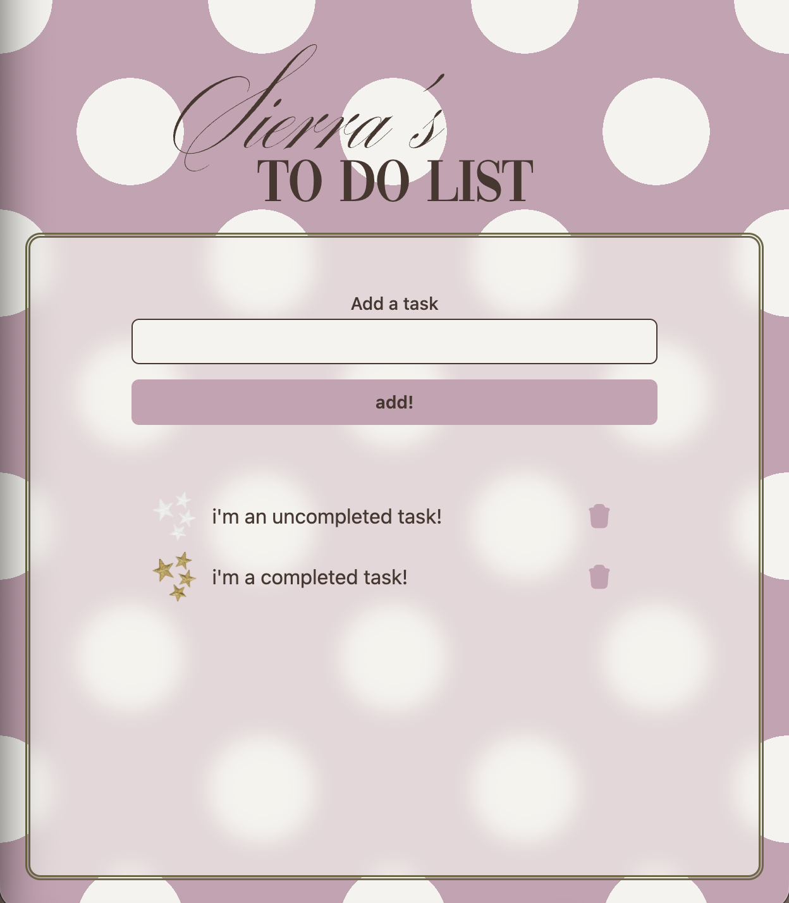

# super simple to do list!

## This is exactly what it says it is... a super simple to do list! 

I've been following along with spring guides to aid with learning spring with java, however I wanted to do a really simple project, thus super simple to do list was born. I also decided to experiment with tailwind as well since I'm not the most familiar with it, but I do enjoy reducing the number of necessary css files if I can!



## Installation
1. Clone the repository onto your local machine.
2. Install the front end dependecies.
```
cd my-app
npm install
```
3. Start the servers in two terminals for the backend and frontend.
```
cd to-do
./mvnw spring-boot:run
```
```
cd my-app
npm run dev
```